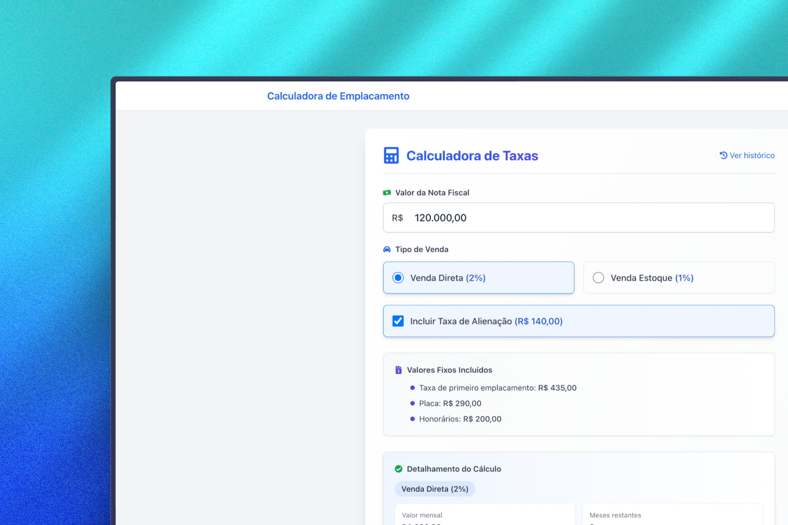

# Calculadora Next.js



## 📋 Sobre o Projeto

Calculadora Next.js é uma aplicação web moderna que implementa uma calculadora com interface intuitiva e responsiva. Este projeto foi desenvolvido utilizando as mais recentes tecnologias web, com foco em desempenho e experiência do usuário.

### ✨ Funcionalidades

- Operações matemáticas básicas (adição, subtração, multiplicação, divisão)
- Cálculos com porcentagem
- Suporte para números decimais
- Interface responsiva que se adapta a diferentes dispositivos
- Tema claro/escuro
- Histórico de operações
- Exportação de cálculos para PDF

## 🚀 Tecnologias Utilizadas

- [Next.js 14](https://nextjs.org/) - Framework React com renderização do lado do servidor
- [TypeScript](https://www.typescriptlang.org/) - Tipagem estática para JavaScript
- [Tailwind CSS](https://tailwindcss.com/) - Framework CSS para estilização
- [React Hooks](https://reactjs.org/docs/hooks-intro.html) - Para gerenciamento de estado
- [Geist Font](https://vercel.com/font) - Família de fontes da Vercel
- [jsPDF](https://github.com/parallax/jsPDF) - Geração de documentos PDF no cliente

## 🔧 Instalação e Execução

### Pré-requisitos

- Node.js 18.x ou superior
- npm, yarn, pnpm ou bun

### Passo a passo

1. Clone o repositório
   ```bash
   git clone https://github.com/seu-usuario/calculadora-next.git
   cd calculadora-next
   ```

2. Instale as dependências
   ```bash
   npm install
   # ou
   yarn install
   # ou
   pnpm install
   # ou
   bun install
   ```

3. Execute o servidor de desenvolvimento
   ```bash
   npm run dev
   # ou
   yarn dev
   # ou
   pnpm dev
   # ou
   bun dev
   ```

4. Acesse [http://localhost:3000](http://localhost:3000) no seu navegador para ver o resultado.

## 📁 Estrutura do Projeto

## Learn More

To learn more about Next.js, take a look at the following resources:

- [Next.js Documentation](https://nextjs.org/docs) - learn about Next.js features and API.
- [Learn Next.js](https://nextjs.org/learn) - an interactive Next.js tutorial.

You can check out [the Next.js GitHub repository](https://github.com/vercel/next.js) - your feedback and contributions are welcome!

## Deploy on Vercel

The easiest way to deploy your Next.js app is to use the [Vercel Platform](https://vercel.com/new?utm_medium=default-template&filter=next.js&utm_source=create-next-app&utm_campaign=create-next-app-readme) from the creators of Next.js.

Check out our [Next.js deployment documentation](https://nextjs.org/docs/app/building-your-application/deploying) for more details.
